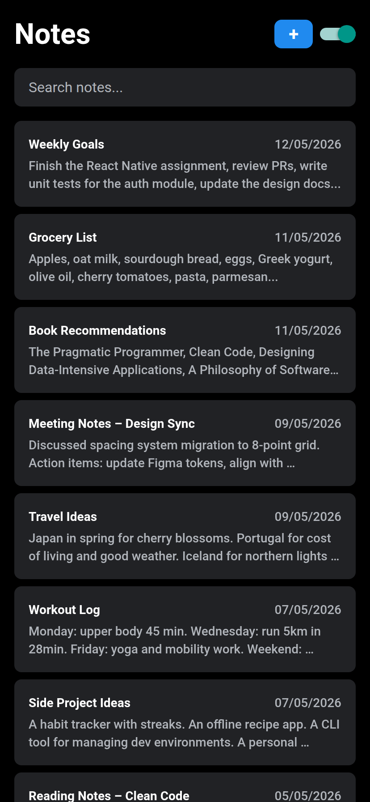

# Simple Notes UI

A clean and minimal notes UI built with Expo and React Native.

This project is part of my [ChaiCode Mobile Dev Cohort 1 Archive](https://github.com/mohdaffankhan/mobile-dev-cohort-1). Checkout my entire journey there!

## Screenshots



## Tech Stack

- **Framework**: Expo 55 with Expo Router
- **Language**: TypeScript
- **UI**: React Native 0.83

## Getting Started

### Prerequisites

- Node.js and npm

### Local Setup

1. **Clone the repository**

```bash
git clone https://github.com/mohdaffankhan/simple-notes-ui.git
```

2. **Install dependencies**

```bash
npm install
```

3. **Start the development server**

```bash
npm start
```
